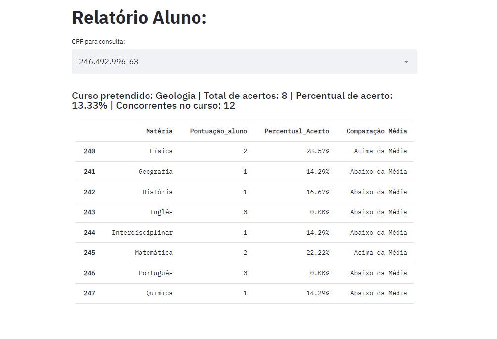

# Einstein Painel
[Link](https://einsteinpainel.herokuapp.com/)


## Table of Contents
1. [Project Motivation](#Motivation)
2. [Getting Started](#getting_started)
	1. [Dependencies](#dependencies)
	2. [Installing](#installing)
	3. [Executing Program](#executing)
3. [Authors & Licensing](#authors)

<a name="Motivation"></a>
## Motivation

 
<a name="getting_started"></a>
## Getting Started

<a name="dependencies"></a>
### Dependencies
* Python 3.5+ (I used Python 3.7)
* Data Science libraries: NumPy, Pandas
* Web App and Data Visualization: Streamlit

<a name="installing"></a>
### Installing
Clone this GIT repository:
```
git clone https://github.com/gabrielboehme/Disaster-Response-Painel.git
```
<a name="executing"></a>
### Executing Program:
1. Run the following commands in the project's root directory to set up your database and model.

    - To run ETL pipeline that cleans data and stores in new .csv files
        `python ETL/transform_data.py`

2. Run the following command in the app's directory to run your web app.
    `streamlit run app.py`

3. Go to http://localhost:8501/

<a name="Author"></a>
## Authors

* [Gabriel Boehme](https://github.com/gabrielboehme/)

<a name="acknowledgement "></a>
## Acknowledgements

* [Einstein Floripa](https://einsteinfloripa.com.br/) for providing the dataset.


<a name="screenshots"></a>
## Screenshots

1. Example of report that you can analyze, with a focus on the general statistics.


2. Example of report that you can analyze, with a focus on the students statistics.




3. Example of report that you can analyze, with a focus on the courses statistics.


